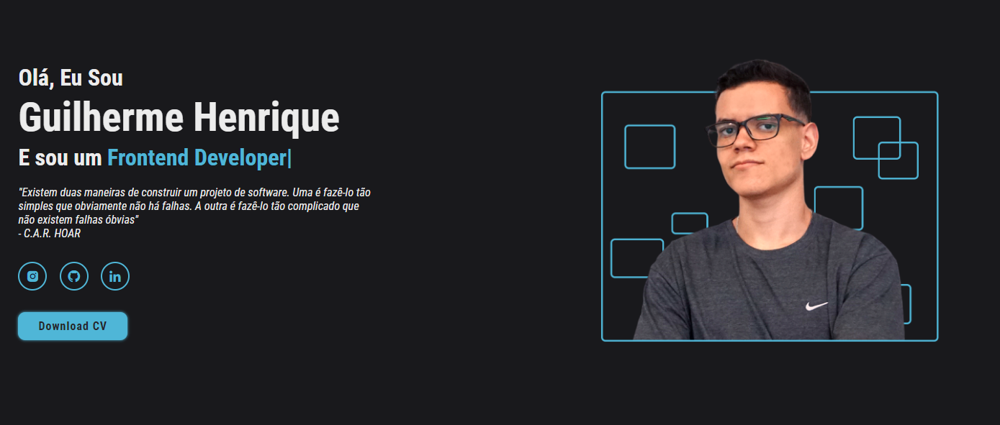

<h1 align="center">
   
   <p>My personal portfolio! 😁</p>
</h1>

<h2 align="center"><a href="https://portfolio-delta-drab-91.vercel.app">See the site ↗</a></h2>


## About 🔍

This is a project in which I show my achievements and a little more about my career.

## Tools 🔨

 - [JavaScript](https://developer.mozilla.org/pt-BR/docs/Web/JavaScript)
 - [Sass](https://sass-lang.com)
 - [Babel](https://babeljs.io)

 # How Contribute ♻

 ```bash
   # Clone the Project
   $ git clone https://github.com/Guihenrique62/portfolio.git
 ```

 ```bash
   # Enter Directory
   $ cd portfolio
 ```

## License 🧾

This project is under the MIT License. See the file License for more details.